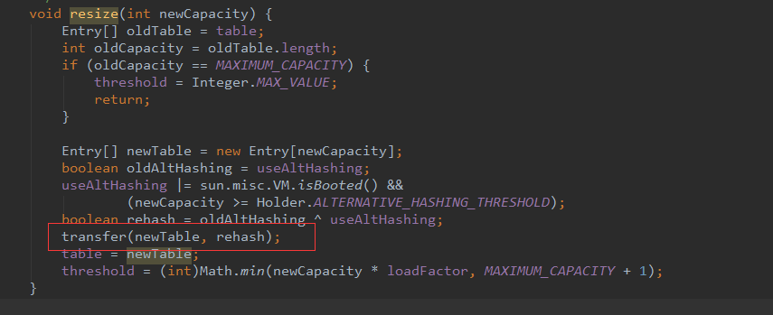
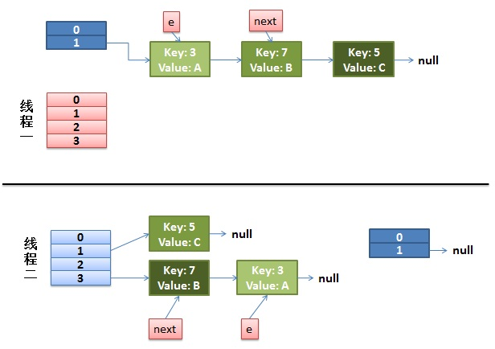
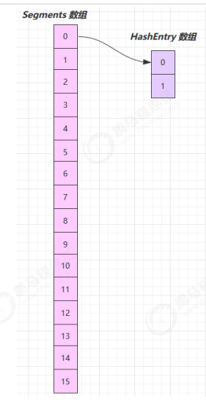

# 目录

[TOC]


# Map接口及实现类


Map 接口 键值对的集合 （双列集合）
	Hashtable 接口实现类， 同步， 线程安全，最古老，不再使用
		Properties，key和value都是字符串类型的，常用于处理属性文件
	HashMap 接口实现类 ，没有同步， 线程不安全，效率高
		LinkedHashMap 双向链表和哈希表实现
	WeakHashMap
	TreeMap 红黑树对所有的key进行排序
	IdentifyHashMap

# JDK1.8 HashMap源码解析

基本上与HashTable(已弃用)类似，除了非同步以及键值可以为null

## CurrentHashMap 与 Hashtable 的异同

Hashtable保证线程安全的方式是使用sychronized来同步代码块，这样多线程访问数据时，同一时刻只会有一个线程访问，效率低
CurrentHashMap采用分段锁机制来同步代码块，多线程访问数据时，每个线程访问一段数据


## HashMap的结构


## jdk7与jdk8中HashMap的不同

| JDK7                               | JDK8                                                |
| ---------------------------------- | --------------------------------------------------- |
| 实例化的同时初始化数组，默认长度16 | 实例化后，第一次调用put方法时初始化数组，默认长度16 |
| 底层是Entry[]+链表（头插法）       | 底层是Node[]+链表（尾插法）\|红黑树                 |


## 成员变量

```java
//默认初始化map的容量：16
static final int DEFAULT_INITIAL_CAPACITY = 1 << 4;
//map的最大容量：2^30
static final int MAXIMUM_CAPACITY = 1 << 30;
//默认的填充因子：0.75，能较好的平衡时间与空间的消耗
static final float DEFAULT_LOAD_FACTOR = 0.75f;
//将链表(桶)转化成红黑树的临界值为8
static final int TREEIFY_THRESHOLD = 8;
//将红黑树转成链表(桶)的临界值位6
static final int UNTREEIFY_THRESHOLD = 6;
//转变成树的table的桶最小容量64，小于该值则不会进行树化
static final int MIN_TREEIFY_CAPACITY = 64;
//上图所示的数组，长度总是2的幂次.如果传入自定义长度，会选择刚大于该数的2的幂次
transient Node<K,V>[] table;


//map中的键值对集合
//HashMap的entrySet()方法返回一个特殊的Set，这个Set使用EntryIterator遍历，而这个Iterator则直接操作于HashMap的内部存储结构table上。通过这种方式实现了“视图”的功能。整个过程不需要任何辅助存储空间。
transient Set<Map.Entry<K,V>> entrySet;
//map中键值对的数量
transient int size;
//用于统计map修改次数的计数器，用于fail-fast抛出ConcurrentModificationException
transient int modCount;
//大于该阈值，则重新进行扩容，threshold = capacity(table.length) * load factor
int threshold;
//填充因子
final float loadFactor;
```


## 构造函数

### 无参构造函数

只会初始化负载因子，不会生成table

```java
public HashMap() {
	this.loadFactor = DEFAULT_LOAD_FACTOR; // all other fields defaulted
}
```

### 带参构造函数

```java
public HashMap(int initialCapacity) {
        this(initialCapacity, DEFAULT_LOAD_FACTOR);
    }
public HashMap(int initialCapacity, float loadFactor) {
    if (initialCapacity < 0)
        throw new IllegalArgumentException("Illegal initial capacity: " +
                                           initialCapacity);
    if (initialCapacity > MAXIMUM_CAPACITY)
        initialCapacity = MAXIMUM_CAPACITY;
    if (loadFactor <= 0 || Float.isNaN(loadFactor))
        throw new IllegalArgumentException("Illegal load factor: " +
                                           loadFactor);
    this.loadFactor = loadFactor;
    this.threshold = tableSizeFor(initialCapacity);
}
```

### 传map转化为HashMap的构造函数

```java
//复制Map
public HashMap(Map<? extends K, ? extends V> m) {
    this.loadFactor = DEFAULT_LOAD_FACTOR;
    putMapEntries(m, false);
}
final void putMapEntries(Map<? extends K, ? extends V> m, boolean evict) {
    int s = m.size();
    if (s > 0) {
        if (table == null) { // pre-size
            float ft = ((float)s / loadFactor) + 1.0F;
            int t = ((ft < (float)MAXIMUM_CAPACITY) ?
                     (int)ft : MAXIMUM_CAPACITY);
            if (t > threshold)
                threshold = tableSizeFor(t);
        }
        else if (s > threshold)
            resize();
        for (Map.Entry<? extends K, ? extends V> e : m.entrySet()) {
            K key = e.getKey();
            V value = e.getValue();
            putVal(hash(key), key, value, false, evict);
        }
    }
}
```


## Node节点

```java
static class Node<K,V> implements Map.Entry<K,V> {
    final int hash;
    final K key;
    V value;
    //可以看出是单链表
    Node<K,V> next;

    Node(int hash, K key, V value, Node<K,V> next) {
        this.hash = hash;
        this.key = key;
        this.value = value;
        this.next = next;
    }

    public final K getKey()        { return key; }
    public final V getValue()      { return value; }
    public final String toString() { return key + "=" + value; }

    public final int hashCode() {
        return Objects.hashCode(key) ^ Objects.hashCode(value);
    }

    public final V setValue(V newValue) {
        V oldValue = value;
        value = newValue;
        return oldValue;
    }

    public final boolean equals(Object o) {
        if (o == this)
            return true;
        if (o instanceof Map.Entry) {
            Map.Entry<?,?> e = (Map.Entry<?,?>)o;
            if (Objects.equals(key, e.getKey()) &&
                Objects.equals(value, e.getValue()))
                return true;
        }
        return false;
    }
}

Node<K,V> newNode(int hash, K key, V value, Node<K,V> next) {
    return new Node<>(hash, key, value, next);
}
```


## put方法

- ①如果定位到的数组位置没有元素 就直接插入。
- ②如果定位到的数组位置有元素就和要插入的key比较，如果key相同就直接覆盖，如果key不相同，就判断p是否是一个树节点，如果是就调用`e = ((TreeNode<K,V>)p).putTreeVal(this, tab, hash, key, value)`将元素添加进入。如果不是就遍历链表插入(插入的是链表尾部)。


```java
public V put(K key, V value) {
    return putVal(hash(key), key, value, false, true);
}
final V putVal(int hash, K key, V value, boolean onlyIfAbsent,
               boolean evict) {
    /**
    * n是Node数组的长度
    * i是当前Node应该存储的位置下标
    **/
    Node<K,V>[] tab; Node<K,V> p; int n, i;
    //当没初始化时，先初始化
    if ((tab = table) == null || (n = tab.length) == 0)
        n = (tab = resize()).length;
    //(n -1)&hash 取hash值的低n-1位，等同于hash%n，值在数组中对应下标
    //判断当前位置是否有元素
    if ((p = tab[i = (n - 1) & hash]) == null)
        //没有元素，直接添加到数组中
        tab[i] = newNode(hash, key, value, null);
    else {
        //有元素的情况
        Node<K,V> e; K k;
        //节点相同的定义：节点哈希值一样&(节点引用一样|节点值一样)
        //判断当前位置的节点与添加节点是否相同
        if (p.hash == hash &&
            ((k = p.key) == key || (key != null && key.equals(k))))
            //如果相等，令e指向该节点
            e = p;
        else if (p instanceof TreeNode)
            //将节点插入红黑树
            e = ((TreeNode<K,V>)p).putTreeVal(this, tab, hash, key, value);
        else {
            //使用尾插法将节点插入链表
            for (int binCount = 0; ; ++binCount) {
                if ((e = p.next) == null) {
                    p.next = newNode(hash, key, value, null);
                    //判断是否超过树化临界值
                    if (binCount >= TREEIFY_THRESHOLD - 1) // -1 for 1st
                        //将链表转化成一棵红黑树
                        treeifyBin(tab, hash);
                    break;
                }
                //如果链表中存在节点与该节点相同，则放弃插入
                if (e.hash == hash &&
                    ((k = e.key) == key || (key != null && key.equals(k))))
                    break;
                p = e;
            }
        }
        //上面循环中找到了e，则根据onlyIfAbsent是否为true来决定是否替换旧值
        if (e != null) { // existing mapping for key
            //获取旧值
            V oldValue = e.value;
            if (!onlyIfAbsent || oldValue == null)
                //将新值赋给节点
                e.value = value;
            //钩子函数，用于给LinkedHashMap继承后使用，在HashMap里是空的
            afterNodeAccess(e);
            return oldValue;
        }
    }
    ++modCount;
    if (++size > threshold)
        resize();
    afterNodeInsertion(evict);
    return null;
}
```


## 数组容量

### 数组初始容量选择tableSizeFor(..)

```java
//自定义数组容量，则生成的数组容量是大于等于该数的2的次幂
//通过移位操作保证了最高位1的后面全是1
//如果capacity=0，则n=-1，移位后还是-1
static final int tableSizeFor(int cap) {
    int n = cap - 1;
    n |= n >>> 1;
    n |= n >>> 2;
    n |= n >>> 4;
    n |= n >>> 8;
    n |= n >>> 16;
    return (n < 0) ? 1 : (n >= MAXIMUM_CAPACITY) ? MAXIMUM_CAPACITY : n + 1;
}
```

jdk1.7中容量选择

```java
int capacity = 1;
while(capacity<initialCapacity){
	capacity <<=1;
}
```


### 数组扩容resize()

数组的扩容是十分耗时的，所以初始时最好根据实际情况传入数组容量

数据扩容


原数组复制到新数组

[hash值重新计算](https://blog.csdn.net/u010425839/article/details/106620440/)


```java
final Node<K,V>[] resize() {
    Node<K,V>[] oldTab = table;
    int oldCap = (oldTab == null) ? 0 : oldTab.length;
    //当使用无参构造器实例化对象时，阈值threshold=0
    //当使用有参构造器实例化对象时，阈值threshold=大于等于传入的初始容量的2的次幂值
    int oldThr = threshold;
    int newCap, newThr = 0;
    if (oldCap > 0) {
        //数组已经存在的情况
        if (oldCap >= MAXIMUM_CAPACITY) {
            //如果数组容量已经大于等于最大的数组容量，则不做任何处理
            threshold = Integer.MAX_VALUE;
            return oldTab;
        }
        else if ((newCap = oldCap << 1) < MAXIMUM_CAPACITY &&
                 oldCap >= DEFAULT_INITIAL_CAPACITY)
            //新容量是旧容量的两倍
            //如果两倍的旧容量小于最大的容量且旧容量大于等于默认初始化容量，则新阈值为旧阈值的两倍
            newThr = oldThr << 1; // double threshold
    }
    else if (oldThr > 0) // initial capacity was placed in threshold
        //使用有参构造器的情况
        //数组容量为旧阈值
        newCap = oldThr;
    else {               // zero initial threshold signifies using defaults
        //使用无参构造器的情况
        //数组容量为默认容量，即16
        //数组阈值为默认阈值，即16*0.75=12
        newCap = DEFAULT_INITIAL_CAPACITY;
        newThr = (int)(DEFAULT_LOAD_FACTOR * DEFAULT_INITIAL_CAPACITY);
    }
    if (newThr == 0) {
        //使用有参构造器的情况或数组已经存在的情况
        //数组新阈值=容量*负载因子
        //如果传入负载因子，就使用传入的。默认为0.75
        float ft = (float)newCap * loadFactor;
        newThr = (newCap < MAXIMUM_CAPACITY && ft < (float)MAXIMUM_CAPACITY ?
                  (int)ft : Integer.MAX_VALUE);
    }
    //将计算的新阈值设为当前map的阈值
    threshold = newThr;
    @SuppressWarnings({"rawtypes","unchecked"})
    //根据计算的新容量来初始化table
    Node<K,V>[] newTab = (Node<K,V>[])new Node[newCap];
    table = newTab;
    //将旧table中的节点复制到新table中，相当于重新散列
    if (oldTab != null) {
        //遍历旧数组
        for (int j = 0; j < oldCap; ++j) {
            Node<K,V> e;
            if ((e = oldTab[j]) != null) {
                //清空旧数组中的元素
                oldTab[j] = null;
                if (e.next == null)
                    //如果节点没有子节点，则直接将节点插入到新数组
                    newTab[e.hash & (newCap - 1)] = e;
                else if (e instanceof TreeNode)
               		//将红黑树拆分
                    ((TreeNode<K,V>)e).split(this, newTab, j, oldCap);
                else { // preserve order
                    //将链表拆分，并不一定是均分
                    //loHead是继续保留在原位置的链表，链表的头部，tail为尾部
                    Node<K,V> loHead = null, loTail = null;
                    //hiHead是拆分了放在新位置的链表
                    Node<K,V> hiHead = null, hiTail = null;
                    Node<K,V> next;
                    do {
                        next = e.next;
                        //拆分原则：
                        //判断e的hash值与旧的容量做位与运算的值是否为0，注意之前是 e.hash & (oldCap - 1)
                        //这是特定的计算，使得旧节点的hash位置转换到新节点的hash位置
                        //oldCap是2的次幂
                        //保留在原来位置
                        if ((e.hash & oldCap) == 0) {
                            if (loTail == null)
                                loHead = e;
                            else
                                loTail.next = e;
                            loTail = e;
                        }
                        //保留在原来位置+oldCap的位置
                        else {
                            if (hiTail == null)
                                hiHead = e;
                            else
                                hiTail.next = e;
                            hiTail = e;
                        }
                    } while ((e = next) != null);
                    if (loTail != null) {
                        loTail.next = null;
                        newTab[j] = loHead;
                    }
                    if (hiTail != null) {
                        hiTail.next = null;
                        newTab[j + oldCap] = hiHead;
                    }
                }
            }
        }
    }
    return newTab;
}
```

### 数组拆分原则

判断e的hash值与旧的容量做位与运算的值是否为0

为0则留在原位置newTable[j]，为1则放在新位置newTable[j+oldCap]

## 链表转为红黑树treeifyBin

条件：链表长度> 8 且当前数组的长度 > 64 

```java
final void treeifyBin(Node<K,V>[] tab, int hash) {
    int n, index; Node<K,V> e;
    //如果当前数组长度小于 转变成树的table的最小容量，则扩容
    //数组容量增大，散列后会更加均匀，减少长链表的生成
    if (tab == null || (n = tab.length) < MIN_TREEIFY_CAPACITY)
        resize();
    else if ((e = tab[index = (n - 1) & hash]) != null) {
        TreeNode<K,V> hd = null, tl = null;
        do {
            TreeNode<K,V> p = replacementTreeNode(e, null);
            if (tl == null)
                hd = p;
            else {
                p.prev = tl;
                tl.next = p;
            }
            tl = p;
        } while ((e = e.next) != null);
        if ((tab[index] = hd) != null)
            hd.treeify(tab);
    }
}
```


## TreeNode节点

TreeNode节点

```java
static final class TreeNode<K,V> extends LinkedHashMap.Entry<K,V> {
    TreeNode<K,V> parent;  // red-black tree links
    TreeNode<K,V> left;
    TreeNode<K,V> right;
    TreeNode<K,V> prev;    // needed to unlink next upon deletion
    boolean red;
    TreeNode(int hash, K key, V val, Node<K,V> next) {
        super(hash, key, val, next);
    }
```


## JDK7中HashMap循环死链




线程2处理后，将key-7的next后指向了key-3

这样导致线程1处理时，就会出现循环




# JDK1.8 LinkedHashMap源码分析

## LinkedHashMap的的结构

在HashMap的基础上，给每个节点添加了双向指针，分别指向前一个节点before和后一个节点after


## 成员变量

```java
private static final long serialVersionUID = 3801124242820219131L;

// 用于指向双向链表的头部
transient LinkedHashMap.Entry<K,V> head;
//用于指向双向链表的尾部
transient LinkedHashMap.Entry<K,V> tail;
/**
 * 用来指定LinkedHashMap的迭代顺序，
 * true则表示按照基于访问的顺序来排列，意思就是最近使用的entry，放在链表的最末尾
 * false则表示按照插入顺序来
 * 默认值为false
 */ 
final boolean accessOrder;
```


## 构造函数

基本就是继承自HashMap的构造函数，唯一不同就是添加了一个accessOrder字段

```java
public LinkedHashMap() {
    super();
    accessOrder = false;
}
public LinkedHashMap(int initialCapacity) {
    super(initialCapacity);
    accessOrder = false;
}
public LinkedHashMap(int initialCapacity, float loadFactor) {
    super(initialCapacity, loadFactor);
    accessOrder = false;
}
public LinkedHashMap(int initialCapacity,
                     float loadFactor,
                     boolean accessOrder) {
    super(initialCapacity, loadFactor);
    this.accessOrder = accessOrder;
}
public LinkedHashMap(Map<? extends K, ? extends V> m) {
    super();
    accessOrder = false;
    putMapEntries(m, false);
}
```


## Entry节点

```java
static class Entry<K,V> extends HashMap.Node<K,V> {
    Entry<K,V> before, after;
    Entry(int hash, K key, V value, Node<K,V> next) {
        super(hash, key, value, next);
    }
}
//重写父类方法
Node<K,V> newNode(int hash, K key, V value, Node<K,V> e) {
    LinkedHashMap.Entry<K,V> p =
        new LinkedHashMap.Entry<K,V>(hash, key, value, e);
    linkNodeLast(p);
    return p;
}
```


## Entry的继承关系


# JDK1.8 HashSet源码分析

HashSet完全是利用HashMap实现的，本质就是将存储的值作用HashMap中的键，由于键的不可重复性，保证了HashSet中值的不重复性

## 成员变量

```
//用于存储的HashMap
private transient HashMap<E,Object> map;
//静态的虚拟值。由于是静态的，所有键值对的值都相同
// Dummy value to associate with an Object in the backing Map
private static final Object PRESENT = new Object();
```

## 构造函数

可以看出HashSet就是将值作为键，然后再生成一个静态的虚拟值，形成键值对存储HashMap。

```java
public HashSet() {
    map = new HashMap<>();
}
public HashSet(int initialCapacity) {
    map = new HashMap<>(initialCapacity);
}
public HashSet(int initialCapacity, float loadFactor) {
    map = new HashMap<>(initialCapacity, loadFactor);
}
HashSet(int initialCapacity, float loadFactor, boolean dummy) {
    map = new LinkedHashMap<>(initialCapacity, loadFactor);
}
public HashSet(Collection<? extends E> c) {
    map = new HashMap<>(Math.max((int) (c.size()/.75f) + 1, 16));
    addAll(c);
}
```


# ArrayList

## 构造函数

以无参数构造方法创建 ArrayList 时，实际上初始化赋值的是一个空数组。当真正对数组进行添加元素操作时，才真正分配容量。即向数组中添加第一个元素时，数组容量扩为10。

```java
 /**
     * 默认初始容量大小
     */
    private static final int DEFAULT_CAPACITY = 10;
    
    private static final Object[] DEFAULTCAPACITY_EMPTY_ELEMENTDATA = {};

    /**
     *默认构造函数，使用初始容量10构造一个空列表(无参数构造)
     */
    public ArrayList() {
        this.elementData = DEFAULTCAPACITY_EMPTY_ELEMENTDATA;
    }
    
    /**
     * 带初始容量参数的构造函数。（用户自己指定容量）
     */
    public ArrayList(int initialCapacity) {
        if (initialCapacity > 0) {
            //初始容量大于0
            //创建initialCapacity大小的数组
            this.elementData = new Object[initialCapacity];
        } else if (initialCapacity == 0) {//初始容量等于0
            //创建空数组
            this.elementData = EMPTY_ELEMENTDATA;
        } else {//初始容量小于0，抛出异常
            throw new IllegalArgumentException("Illegal Capacity: "+
                                               initialCapacity);
        }
    }


   /**
    *构造包含指定collection元素的列表，这些元素利用该集合的迭代器按顺序返回
    *如果指定的集合为null，throws NullPointerException。 
    */
     public ArrayList(Collection<? extends E> c) {
        elementData = c.toArray();
        if ((size = elementData.length) != 0) {
            // c.toArray might (incorrectly) not return Object[] (see 6260652)
            if (elementData.getClass() != Object[].class)
                elementData = Arrays.copyOf(elementData, size, Object[].class);
        } else {
            // replace with empty array.
            this.elementData = EMPTY_ELEMENTDATA;
        }
    }
```


## 插入

- 当我们要 add 进第1个元素到 ArrayList 时，elementData.length 为0 （因为还是一个空的 list），因为执行了 `ensureCapacityInternal()` 方法 ，所以 minCapacity 此时为10。此时，`minCapacity - elementData.length > 0 `成立，所以会进入 `grow(minCapacity)` 方法。
- 当add第2个元素时，minCapacity 为2，此时e lementData.length(容量)在添加第一个元素后扩容成 10 了。此时，`minCapacity - elementData.length > 0 `不成立，所以不会进入 （执行）`grow(minCapacity)` 方法。
- 添加第3、4···到第10个元素时，依然不会执行grow方法，数组容量都为10。
- 直到添加第11个元素，minCapacity(为11)比elementData.length（为10）要大。进入grow方法进行扩容。

grow

- 当add第1个元素时，oldCapacity 为0，经比较后第一个if判断成立，newCapacity = minCapacity(为10)。但是第二个if判断不会成立，即newCapacity 不比 MAX_ARRAY_SIZE大，则不会进入 `hugeCapacity` 方法。数组容量为10，add方法中 return true,size增为1。
- 当add第11个元素进入grow方法时，newCapacity为15，比minCapacity（为11）大，第一个if判断不成立。新容量没有大于数组最大size，不会进入hugeCapacity方法。数组容量扩为15，add方法中return true,size增为11。
- 以此类推······

图里面画错了，新容量=旧容量*1.5


```java
/**
     * 将指定的元素追加到此列表的末尾。 
     */
public boolean add(E e) {
    //添加元素之前，先调用ensureCapacityInternal方法
    ensureCapacityInternal(size + 1);  // Increments modCount!!
    //这里看到ArrayList添加元素的实质就相当于为数组赋值
    elementData[size++] = e;
    return true;
}
//得到最小扩容量
private void ensureCapacityInternal(int minCapacity) {
    if (elementData == DEFAULTCAPACITY_EMPTY_ELEMENTDATA) {
        // 获取默认的容量和传入参数的较大值，作为初始下限
        minCapacity = Math.max(DEFAULT_CAPACITY, minCapacity);
    }
    ensureExplicitCapacity(minCapacity);
}
//判断是否需要扩容
private void ensureExplicitCapacity(int minCapacity) {
    modCount++;

    // overflow-conscious code
    //minCapacity表示插入数据后，数据个数，必须要满足，即容量下限
    //elementData.length表示当前容量，初始为0
    if (minCapacity - elementData.length > 0)
        //调用grow方法进行扩容，调用此方法代表已经开始扩容了
        grow(minCapacity);
}
/**
     * 要分配的最大数组大小
     */
private static final int MAX_ARRAY_SIZE = Integer.MAX_VALUE - 8;

/**
     * ArrayList扩容的核心方法。
     */    
/**
     * 要分配的最大数组大小，非常大的数了
     */
private static final int MAX_ARRAY_SIZE = Integer.MAX_VALUE - 8;
private void grow(int minCapacity) {
    // oldCapacity为旧容量，newCapacity为新容量
    int oldCapacity = elementData.length;
    //将oldCapacity 右移一位，其效果相当于oldCapacity /2，
    //我们知道位运算的速度远远快于整除运算，整句运算式的结果就是将新容量更新为旧容量的1.5倍，
    int newCapacity = oldCapacity + (oldCapacity >> 1);
    //然后检查新容量是否大于最小需要容量，若还是小于最小需要容量，那么就把最小需要容量当作数组的新容量，
    if (newCapacity - minCapacity < 0)
        newCapacity = minCapacity;
    // 如果新容量大于 MAX_ARRAY_SIZE,进入(执行) `hugeCapacity()` 方法来比较 minCapacity 和 MAX_ARRAY_SIZE，
    //如果minCapacity大于最大容量，则新容量则为`Integer.MAX_VALUE`，否则，新容量大小则为 MAX_ARRAY_SIZE 即为 `Integer.MAX_VALUE - 8`。
    if (newCapacity - MAX_ARRAY_SIZE > 0)
        newCapacity = hugeCapacity(minCapacity);
    // minCapacity is usually close to size, so this is a win:
    elementData = Arrays.copyOf(elementData, newCapacity);
}

private static int hugeCapacity(int minCapacity) {
    if (minCapacity < 0) // overflow
        throw new OutOfMemoryError();
    //对minCapacity和MAX_ARRAY_SIZE进行比较
    //若minCapacity大，将Integer.MAX_VALUE作为新数组的大小
    //若MAX_ARRAY_SIZE大，将MAX_ARRAY_SIZE作为新数组的大小
    //MAX_ARRAY_SIZE = Integer.MAX_VALUE - 8;
    return (minCapacity > MAX_ARRAY_SIZE) ?
        Integer.MAX_VALUE :
    MAX_ARRAY_SIZE;
}
```


## `System.arraycopy()` 和 `Arrays.copyOf()`方法

```java
/**
* 在此列表中的指定位置插入指定的元素。 
*先调用 rangeCheckForAdd 对index进行界限检查；然后调用 ensureCapacityInternal 方法保证capacity足够大；
*再将从index开始之后的所有成员后移一个位置；将element插入index位置；最后size加1。
*/
public void add(int index, E element) {
    rangeCheckForAdd(index);

    ensureCapacityInternal(size + 1);  // Increments modCount!!
    //arraycopy()方法实现数组自己复制自己
    //elementData:源数组;index:源数组中的起始位置;elementData：目标数组；index + 1：目标数组中的起始位置； size - index：要复制的数组元素的数量；
    System.arraycopy(elementData, index, elementData, index + 1, size - index);
    elementData[index] = element;
    size++;
}


copyof方法实际上是调用arraycopy方法，只不过将新数组封装在了函数中
/**
以正确的顺序返回一个包含此列表中所有元素的数组（从第一个到最后一个元素）; 返回的数组的运行时类型是指定数组的运行时类型。 
*/
public Object[] toArray() {
    //elementData：要复制的数组；size：要复制的长度
    return Arrays.copyOf(elementData, size);
}
```

## `ensureCapacity`方法

**最好在 add 大量元素之前用 `ensureCapacity` 方法，以减少增量重新分配的次数**

```java
/**
    如有必要，增加此 ArrayList 实例的容量，以确保它至少可以容纳由minimum capacity参数指定的元素数。
     *
     * @param   minCapacity   所需的最小容量
     */
public void ensureCapacity(int minCapacity) {
    int minExpand = (elementData != DEFAULTCAPACITY_EMPTY_ELEMENTDATA)
        // any size if not default element table
        ? 0
        // larger than default for default empty table. It's already
        // supposed to be at default size.
        : DEFAULT_CAPACITY;

    if (minCapacity > minExpand) {
        ensureExplicitCapacity(minCapacity);
    }
}
```


# ConcurrentHashMap

Java7 中 ConcurruentHashMap 使用的分段锁，也就是每一个 Segment 上同时只有一个线程可以操作，每一个 Segment 都是一个类似 HashMap 数组的结构，它可以扩容，它的冲突会转化为链表。但是 Segment 的个数一但初始化就不能改变，默认为16个。不是懒加载。使用reentrantlock



Java8 中的 ConcruuentHashMap 使用的 Synchronized 锁（插入链表的时候）加 CAS （添加链表的第一个元素时）的机制。结构也由 Java7 中的 **Segment 数组（） + HashEntry 数组 + 链表** 进化成了 **Node 数组 + 链表 / 红黑树**，Node 是类似于一个 HashEntry 的结构。它的冲突再达到一定大小时会转化成红黑树，在冲突小于一定数量时又退回链表。