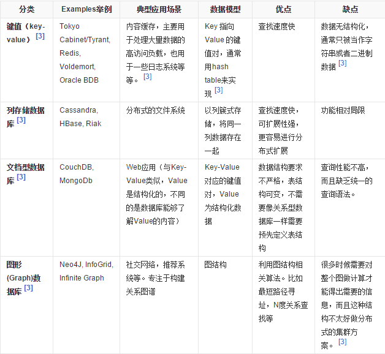
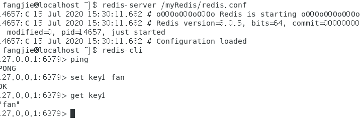
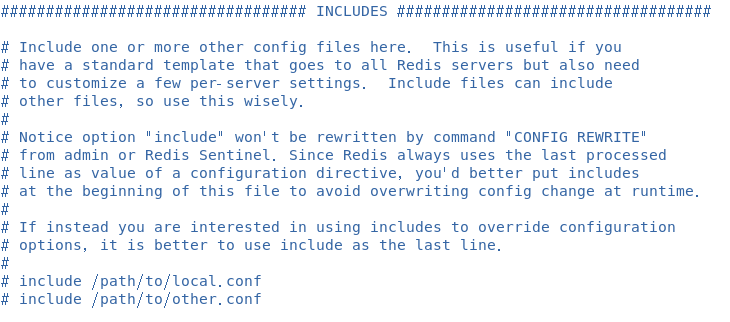
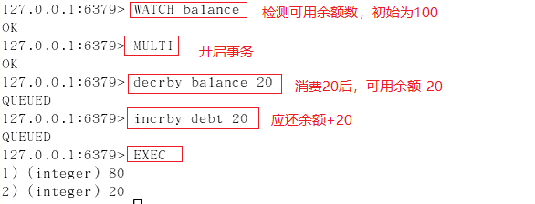
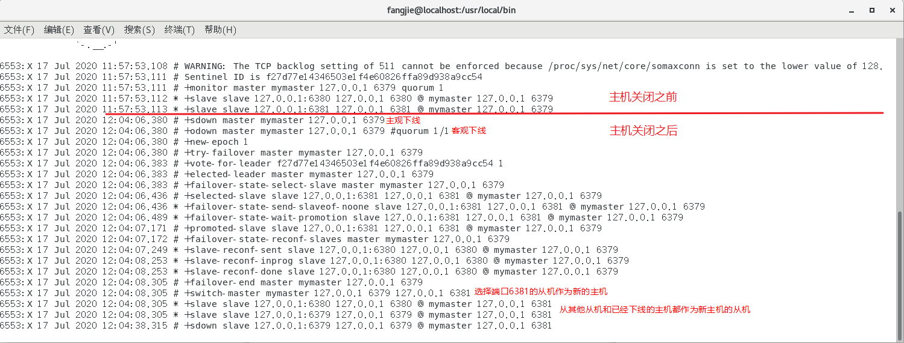

# 目录

[TOC]

# NoSql入门和概述

## 为什么使用NoSql

### 传统方式的缺陷

- 数据量过大，一个机器放不下
- 数据的索引（对于Mysql而言，B+ Tree过大，不能一次性读到内存）
- 访问量(读写混合)一个实例不能承受


### Memcached(缓存)+MySql+垂直拆分

使用多台服务器存储，解决第一个问题

这里的缓存不是指redis这些，而是mysql自带的缓存


### Mysql主从复制，读写分离

主服务器专门用来写，从服务器专门用来读。解决第三个问题

但是引出一个问题，数据量大时，主服务器写压力过大


### 分表分库+水平拆分+mysql集群

将表进行拆分放入不同的库中，最终形成一个集群，分散了主服务器的写压力

**集群和分布式的区别**

- 集群：多台服务器完成一个任务
- 分布式：不同模块完成不同任务。每一个模块可以由集群实现。


### 使用Mysql局限

对于一些很大的文件，使用Mysql存储后，读取和查询的效率会非常低


### 目前常用架构

除了Mysql服务器之外，还有许多其他存储服务器（文件服务器、流媒体服务器），对于不同类型的数据都应该存储在


### 使用NoSql原因

NoSql是相对于传统关系型数据库而言的，在互联网时代，数据之前都是存在关联的，从数据中挖掘这种关联成为大数据时代的核心。对于传统关系型数据库来说，数据之间的关联就是通过表的连接实现，但是表连接的代价太大，不适合挖掘这种关系，因此引入了NoSql。


## NoSql的优势

### 易扩展

- 非关系型数据库不需要向关系型数据库那样，在使用数据之前，必须先建表（定义数据之间的关系），直接使用即可。
- 由于不需要定义数据类型，NoSql可以直接使用任何类型的数据，数据灵活度更高。

### 高性能

一般MySQL使用Query Cache，每次表的更新Cache就失效，是一种大粒度的Cache，在针对web2.0的交互频繁的应用，Cache性能不高。而NoSQL的Cache**是记录级的**，是一种细粒度的Cache，所以NoSQL在这个层面上来说就要性能高很多了


### RDBMS vs NoSQL

RDBMS
- 高度组织化结构化数据
- 结构化查询语言（SQL）
- 数据和关系都存储在单独的表中。
- 数据操纵语言，数据定义语言
- 严格的一致性
- 基础事务

NoSQL
- 代表着不仅仅是SQL
- 没有声明性查询语言
- 没有预定义的模式
-键 - 值对存储，列存储，文档存储，图形数据库
- 最终一致性，而非ACID属性
- 非结构化和不可预知的数据
- CAP定理
- 高性能，高可用性和可伸缩性


## 常用的NoSql数据库

- Redis
- Memcache
- Mongdb

这些数据库特点主要有

1. KV。使用键值对方式读写数据
2. Cache。用作高速缓存
3. Persistence。可以持久化


## 3V与3高

大数据时代，数据有3V特性

- Volume 海量
- Variety 多样
- Velocity 实时

针对这些挑战，对于大型系统来说，就有了三个要求

- 高并发
- 高性能
  - 高性能和高并发密切相关。
- 高可用：对系统提供服务的时间的衡量
  - 如果一直提供服务，可用性就是100%


## 当下NoSql的应用

都是NoSql+Sql一起使用

淘宝架构升级


### 多数据源问题

- 商品基本信息
  - 对于商品基本信息而言，一经添加，其实是很少修改的
  - 存储在mysql中
- 商品的描述、详情、评价信息（多文字类）
  - 由于多文字，IO读写性能很差
  - 存储在MongDB中
- 商品的图片
  - 分布式文件系统中，例如淘宝TFS、谷歌GFS、Hadoop HDFS
- 商品关键字
  - 搜索引擎ISearch
- 商品的波段性的热点高频信息
  - 如情人节的巧克力，玫瑰花等
  - 存储在内存数据库，如Tair、Redis、Memcache
- 商品的交易、价格计算、积分累计
  - 使用支付宝接口和第三方接口


**多数据源也带来了很多问题**

- 可维护性差
- 使用困难

**解决方式**


### 去IOE化

去除IBM小型机、Oracle数据库及EMC存储设备


## NoSql数据模型

NoSql数据模型就是一种聚合模型

- KV键值对

- Bson 是一种类json的一种二进制形式的存储格式，简称Binary JSON，它和JSON一样，支持内嵌的文档对象和数组对象

- 列族

  根据行键可以获取右边所有的KV键值对

  

- 图形


## NoSql数据库四大分类

就是按使用的数据模型进行分类

- KV键值对
  - redis
  - Memcache
- 文档型数据库，bson格式较多
  - Couch DB
  - MongDB
    - MongoDB 是一个基于**分布式文件存储的数据库**。由 C++ 语言编写。旨在为 WEB 应用提供可扩展的高性能数据存储解决方案。
    - MongoDB 是一个介于关系数据库和非关系数据库之间的产品，是非关系数据库当中功能最丰富，最像关系数据库的。

- 列存储数据库
  - Cassandra
  - HBase
  - 分布式文件系统
- 图关系数据库
  - Neo4J
  - InfoGrid

**四者对比**




## NoSql CAP+BASE

- Consistency 强一致性
- Availability 可用性
- Partition Tolerance 分区容错性


### CAP 3进2

在分布式存储系统中，最多只能实现上面两种。而分区容错性是必须实现的

所以就是在强一致性和可用性之间抉择

根据 CAP 原理将 NoSQL 数据库分成了满足 CA 原则、满足 CP 原则和满足 AP 原则三 大类：

- CA - 单点集群，满足一致性，可用性的系统，通常在可扩展性上不太强大（只能纵向扩展，不能横向扩展）。
- CP - 满足一致性，分区容忍必的系统，通常性能不是特别高。
  - 大多数网站选择
- AP - 满足可用性，分区容忍性的系统，通常可能对一致性要求低一些。
  - 高并发场景使用


### 如今网站的需求

- 数据库事务一致性需求
  - 很多web实时系统并不要求严格的数据库事务，对读一致性的要求很低， 有些场合对写一致性要求并不高。允许实现最终一致性。
- 数据库的写实时性和读实时性需求
  - 对关系数据库来说，插入一条数据之后立刻查询，是肯定可以读出来这条数据的，但是对于很多web应用来说，并不要求这么高的实时性
  - 比方说发一条消息之后，过几秒乃至十几秒之后，我的订阅者才看到这条动态是完全可以接受的，但是要保证自己可以很快查看到这条动态。
- 对复杂的SQL查询，特别是多表关联查询的需求 
  - 任何大数据量的web系统，都非常忌讳多个大表的关联查询，以及复杂的数据分析类型的报表查询，特别是SNS类型的网站，从需求以及产品设计角 度，就避免了这种情况的产生。往往更多的只是单表的主键查询，以及单表的简单条件分页查询，SQL的功能被极大的弱化了


### BASE

BASE就是为了解决关系数据库强一致性引起的问题而引起的可用性降低而提出的解决方案。也就是为了应付一些高并发的场景，从CP转为AP后的解决方式

BASE其实是下面三个术语的缩写：

- 基本可用（Basically Available）
- 软状态（Soft state）
- 最终一致（Eventually consistent）：只要保证最终结果正确就行

它的思想是通过让系统放松对某一时刻数据一致性的要求来换取系统整体伸缩性和性能上改观。


# Redis基础

## Redis介绍

[参考网址](https://redis.io/)

**Re**mote **Di**ctionary **S**erver（远程字典服务器）

Redis是完全开源免费的，使用C语言编写，最受BSD协议，是一个基于KV键值对存储的高性能分布式内存数据库。

BSD开源协议是一个给于使用者很大自由的协议。可以自由的使用，修改源代码，也可以将修改后的代码作为开源或者专有软件再发布。

- KV键值对
- 基于内存运行
- 支持持久化

**Redis优势**

- 支持数据持久化，重启之后可以从磁盘中加载，继续运行
- 不仅仅支持简单的KV键值对，还有list set zset hash等数据结构的存储
- 支持master-slave模式数据备份

**Redis使用场景**

- 取出前N条数据
- 发布订阅消息系统
- 定时器、计数器


## Redis安装

### Redis安装

[参考](https://redis.io/download)

下载redis

```shell
wget http://download.redis.io/releases/redis-6.0.5.tar.gz
tar xzf redis-6.0.5.tar.gz
cd redis-6.0.5
make
make install
```

使用make命令后，可能会报错


原因是没安装gcc环境

```shell
# yum安装gcc
yum install gcc-c++
# 清空上次编译失败残留文件
make distclean
# 编译
make
```

必须清空，不然会报错


再次执行，可能依然会报错


原因：gcc版本过旧，和redis6.0.5不匹配

```shell
# 查看gcc版本
gcc -v
# 升级到9.3.1版本，只针对本次使用
yum -y install centos-release-scl
yum -y install devtoolset-9-gcc devtoolset-9-gcc-c++ devtoolset-9-binutils
scl enable devtoolset-9 bash
# 设置永久升级
echo "source /opt/rh/devtoolset-9/enable" >>/etc/profile
```

然后再次执行编译安装

```shell
make
make install
# 运行redis
src/redis-server
```

出现下面页面表示安装成功


最终的程序会安装到/usr目录下

```shell
# 查看安装的redis程序
cd /usr/local/bin
```

文件说明：

- redis-benchmark 启动性能测试工具
- redis-check-rdb redis-check-aof 修复有问题的rdb和aof文件
- redis-sentinel redis集群使用
- redis-cli redis客户端
- redis-server redis服务器启动命令


### Redis配置

修改配置文件

```shell
# 在根目录下创建一个目录
mkdir /myRedis
# 在opt目录下复制配置文件到刚创建的目录，不要删除原配置文件，用作备份
cp redis.conf /myRedis/

# 然后修改配置/myRedis/redis.conf，表示允许redis后台运行。darmon：后台程序
daemonize yes
```


### 使用Redis

```shell
# 启动redis，并让其加载自定义配置
redis-server /myRedis/redis.conf
# 连接redis客户端，如果此时连接不上去。关闭当前终端，重新启动redis，再连接
redis-cli
# 查看redis进程
ps -ef|grep redis
# 结束进程
redis-cli shutdown
```




## 使用Redis

### Redis运行相关知识

1. Redis使用**单进程模式**来处理客户端的请求。

   - 对读写等事件的响应是通过对epoll函数的包装实现
   - Redis的实际执行效率完全依靠主进程的执行效率

2. redis默认创建16个数据库

   - 从配置文件可以看到，使用select dbid命令可以切换数据库

   

3. redis索引是从0开始

4. 默认端口是6379


### 常用命令

```shell
# 选择数据库
select dbid
# 显示当前数据库中key的数量（默认创建4个key
DBSIZE
# 清空当前库
FLUSHDB
# 清空全部库
FLUSHALL
```


## Redis五大数据类型

- 字符串String
  - string是redis最基本的类型，你可以理解成与Memcached一模一样的类型，一个key对应一个value。
  - string类型是二进制安全的。意思是redis的string可以包含任何数据。比如jpg图片或者序列化的对象 。
  - string类型是Redis最基本的数据类型，一个redis中字符串value最多可以是512M

- Hash
  - Redis hash 是一个键值对集合。
  - Redis hash是一个string类型的field和value的映射表，hash特别适合用于存储对象。
  - 类似Java里面的Map<String,Object>

- List
  - Redis 列表是简单的字符串列表，按照插入顺序排序。你可以添加一个元素导列表的头部（左边）或者尾部（右边）。
  - 它的底层实际是个链表

- Set
  - Redis的Set是string类型的无序集合。它是通过HashTable(线程安全)实现实现的，

- Zset sorted set有序集合
  - Redis zset 和 set 一样也是string类型元素的集合,且不允许重复的成员。
  - 不同的是每个元素都会关联一个double类型的分数。
  - redis正是通过分数来为集合中的成员进行从小到大的排序。zset的成员是唯一的,但分数(score)却可以重复。


## redis命令手册

[参考网址](http://doc.redisfans.com/)

### key

| 命令               | 含义                                                         | 举例                                                     |
| ------------------ | ------------------------------------------------------------ | -------------------------------------------------------- |
| key pattern        | 查找符合给定模式的key                                        | key *--显示所有key<br />key key?--显示所有以key开头的key |
| exists key         | 判断key是否存在                                              |                                                          |
| move key dbid      | 将key移动到dbid库                                            |                                                          |
| expire key seconds | 给key设定过期时间为seconds秒                                 |                                                          |
| ttl key            | 查看还有多少秒过期，-1表示永不过期，-2表示已过期。过期后，key自动删除 |                                                          |
| type key           | 查看key的数据类型                                            |                                                          |
| del key            | 删除key                                                      |                                                          |


### Value-String

- 单值单value

| 命令                               | 含义                                                         | 说明                                                         |
| ---------------------------------- | ------------------------------------------------------------ | ------------------------------------------------------------ |
| set/del/append/get                 | 增删改查                                                     | set k1 value1，如果已经存在k1，则覆盖<br />append k1 value2，此时<k1,value1value2> |
| strlen                             | 获取值的字符数量                                             |                                                              |
| Incr/decr/incrby/decrby            | 数字加减（必须是数字）                                       | set k2 1<br />Incr k2，自增1<br />Incrby k2 2，加2           |
| getrange/setrange                  | 获取字符串中的子串                                           | set k2 abcdef<br />getrange k2 0 -1，-1表示末尾，结果为abcdef<br />setrange k2 0 0123，从索引0处开始替换，k2=0123ef |
| setex key seconds value<br />setnx | set with expire设置带过期时间的key<br />set if no exists如果不存在才添加 | setex k3 10 value3，存入<k3,value3>，存活时间10s             |
| mset/msetnx/mget                   | 同时存入和取出多个key                                        | mset k1 value1 k2 value2 k3 value3<br />mget k1 k2 k3        |
| getset                             | 先获取旧值，再写入新值                                       |                                                              |


### Value-List

- 它是一个字符串**双向链表**，left、right（头和尾）都可以插入添加；
- 单值多value
- 如果键不存在，创建新的链表；
- 如果键已存在，新增内容；
- 如果值全移除，对应的键也就消失了。
- 链表的操作无论是头和尾效率都极高，但假如是对中间元素进行操作，效率就很惨淡了。

| 命令                                  | 含义                                                         | 说明                                               |
| ------------------------------------- | ------------------------------------------------------------ | -------------------------------------------------- |
| lpush/rpush key value1 [value2...]    | 从左边或右边插入多个值                                       | 左边插入，获取的值相反<br />右边插入，获取的值相同 |
| lpop/rpop                             | 从左边或右边移除一个值，并返回                               |                                                    |
| lrange key start stop                 | 获取[start,stop]范围内的值                                   | lrange key 0 -1 ，显示列表所有元素                 |
| Iindex key index                      | 根据索引获取value                                            |                                                    |
| Llen                                  | 获取列表的长度                                               |                                                    |
| LREM key count value                  | 从左边开始，移除key对应的列表中，前count个value              |                                                    |
| Ltrim key start stop                  | 只保留列表中[start,stop]范围内的数据                         |                                                    |
| RpopLpush key1 key2                   | key1对应列表右边移除一个元素，返回，然后将该元素从左边插入到key2对应列表 |                                                    |
| Lset key index value                  | 通过索引设置列表元素值                                       |                                                    |
| Linsert key before\|after pivot value | 从左边开始，向列表中第一个值为pivot的左边或右边插入value     |                                                    |


### Value-Set

| 命令                         | 含义                                                 | 说明                 |
| ---------------------------- | ---------------------------------------------------- | -------------------- |
| Sadd key value1 [value2...]  | 向集合中添加多个元素                                 |                      |
| Smembers key                 | 显示集合中所有元素                                   |                      |
| Sismember key member         | 判断集合是否包含member元素                           |                      |
| Scard key                    | 返回集合中元素个数                                   |                      |
| Srem key member1 [member2..] | 移除集合中成员                                       |                      |
| Srandmember key count        | 随机返回集合中count个元素                            | 可以用来模拟抽奖环节 |
| Spop key                     | 随机移除列表中一个元素，并返回                       |                      |
| Smove key1 key2 member       | 将key1对应的集合中的member元素移动到key2对应的集合中 |                      |
| Sdiff key1 key2              | 返回key1与key2对应集合的差集(key1中有，key2中没有)   |                      |
| Sinter key1 key2             | 返回key1与key2对应集合的交集                         |                      |
| Sunion key1 key2             | 返回key1与key2对应集合的并集                         |                      |


### Value-Hash

Redis hash是一个**string类型**的field和value的映射表，即< key, Map<field,value> >

Redis 中每个 hash 可以存储 2^32 - 1 键值对（40多亿）

| 命令                                                         | 含义                                             | 说明               |
| ------------------------------------------------------------ | ------------------------------------------------ | ------------------ |
| hset key field value<br />hget key field<br />hmset key field1 value1 [field2 value2...]<br />hget key field1 [field2...]<br />hgetall key<br />hdel key field1 [field2...]<br />hsetnx key filed value | 存取数据                                         |                    |
| hlen key                                                     | 获取哈希表中所有字段数量                         |                    |
| hexists key field                                            | 判断哈希表中是否存在field字段                    |                    |
| hkeys key<br />hvals key                                     | 获取哈希表中所有field<br />获取哈希表中所有field |                    |
| hincrby key field increment<br />hincrbyfloat key field increment | 在指定字段的（整数值或浮点数值）上进行加减操作   | 加为正数，减为负数 |


### Value-Zset

在set的基础之上，加了一个score，然后使用score对数据**从小到大**排序

| 命令                                                         | 含义                                                         | 说明                                                         |
| ------------------------------------------------------------ | ------------------------------------------------------------ | ------------------------------------------------------------ |
| zadd key score1 member1 [score2 member2...]<br />zrem key member1 [member2...] | 添加、删除元素                                               |                                                              |
| zrange key start stop [withscores]<br />zrevrange key start stop [withscores] | 取出下标在[start,stop]范围内的数据<br />逆序取出             | zadd key 1 aa 2 bb 3 cc<br />zrange key 0 -1，结果{"aa","bb","cc"}<br />zrevrange key 0 -1,结果{"cc","bb","aa"} |
| zrangebyscore key min max <br /><br />zrevrangebyscore key max min<br />[withscores] <br />[limit offset len] | 取出分数在[min,max]范围内的数据<br />逆序取出[max,min]范围内数据<br />带分数<br />返回下标为[offset到offset+len-1的数据 | (表示不包含<br />zrangebyscore key 60 (90 返回分数在[60,90)的数据 |
| zcard key<br />zount key min max<br />zrank key member<br />zrevrank key member<br />zscore key member | 获取有序集合中元素个数<br />获取分数在[min,max]内的元素个数<br />获取指定成员的索引<br />获取指定成员的逆序索引<br />获取指定成员的分数 |                                                              |


## 解析配置文件

[参考网址](https://blog.csdn.net/qq_42534026/article/details/106730314)

### 数据单位


### INCLUDS

可以用于引入其他配置文件



### MODULES

用于启动时加载模块。如果服务器无法加载模块
它将中止。可以使用多个loadmodule指令。


### NETWORK 通用

| 字段           | 含义                                                         | 默认项                                           |
| -------------- | ------------------------------------------------------------ | ------------------------------------------------ |
| bind           | Redis服务监听地址，用于Redis客户端连接                       | bind 127.0.0.1                                   |
| protected-mode | 安全保护，开启后只能通过bind ip（加密码）访问                | protected-mode yes                               |
| prot           | Redis监听端口号                                              | port 6379                                        |
| tcp-backlog    | TCP连接中accept queue的长度，而Linux的默认somaxconn参数值是128 | tcp-backlog 511                                  |
| unixsocket     | 指定 unix socket 的路径                                      | unixsocket /tmp/redis.sock                       |
| unixsocketperm | 指定 unix socket file 的权限                                 | unixsocketperm 700<br />（仅文件拥有者可以操作） |
| timeout        | 在客户端闲置多少秒后断开连接。默认为0，表示一直不断开        | timeout 0                                        |
| tcp-keepalive  | 用来定时向client发送tcp_ack包来探测client是否存活的。建议设置为60s | tcp-keepalive 300                                |

**tcp-backlog字段说明**

TCP三次握手

1. client发送SYN到server，将状态修改为SYN_SEND，如果server收到请求，则将状态修改为SYN_RCVD，并把该请求放到syns queue队列中。
2. server回复SYN+ACK给client，如果client收到请求，则将状态修改为ESTABLISHED，并发送ACK给server。
3. server收到ACK，将状态修改为ESTABLISHED，并把该请求从syns queue中放到accept queue。

因此在linux系统内核中维护了两个队列：syns queue和accept queue

- syns queue 
  - 用于保存半连接状态的请求，其大小通过/proc/sys/net/ipv4/tcp_max_syn_backlog指定，一般默认值是512，不过这个设置有效的前提是系统的syncookies功能被禁用。互联网常见的TCP SYN FLOOD恶意DOS攻击方式就是建立大量的半连接状态的请求，然后丢弃，导致syns queue不能保存其它正常的请求。
- accept queue
  - 用于保存全连接状态的请求，其大小通过/proc/sys/net/core/somaxconn指定，在使用listen函数时，内核会根据传入的==backlog参数==与**系统参数somaxconn**，取二者的**较小值**。
  - server端执行了accept后才会从这个队列中移除这个连接
  - 如果accpet queue队列满了，server将发送一个ECONNREFUSED错误信息Connection refused到client。
  - ==所以对于一些高并发，且慢连接的场景，队列容量可能不够，需要同时修改backlog和somaxconn参数==


### TLS/SSL 安全套接字

默认情况下，禁用TLS / SSL。要启用它，请使用“ tls-port”配置。


### General 通用

| 字段             | 含义                                                         | 默认项                          |
| ---------------- | ------------------------------------------------------------ | ------------------------------- |
| **Daemonize**    | 以守护线程(后台)方式运行                                     | daemonize no                    |
| supervised       | 可以通过upstart和systemd管理Redis守护进程，这个参数是和具体的操作系统相关的。 | supervised no                   |
| pidfile          | 当redis以守护模式启动时，pid文件路径                         | pidfile /var/run/redis_6379.pid |
| loglevel         | 日志记录等级，有4个可选值<br />debug（开发），verbose（默认值），notice（生产），warning（警告） | loglevel notice                 |
| logfile          | 日志文件的位置，当指定为空字符串时，为标准输出。<br />如果redis已守护进程模式运行，那么日志将会输出到 /dev/null<br />若指定了路径，日志将会输出到指定文件 。 | logfile ""                      |
| syslog-enabled   | 是否把日志记录到系统日志                                     | syslog-enabled no               |
| syslog-ident     | 指定syslog里的日志标识                                       | syslog-ident redis              |
| syslog-facility  | 指定syslog设备(facility)，必须是user或者local0-local7        | syslog-facility local0          |
| databases        | 可用数据库数量                                               | database 16                     |
| always-show-logo | 当开始登录到标准输出，Redis是否显示一个log                   | always-show-logo yes            |


### SNAPSHOTTING 快照

RDB备份

| 字段                        | 含义                                                         | 默认项                                       |
| --------------------------- | ------------------------------------------------------------ | -------------------------------------------- |
| save                        | 多少秒保存数据到磁盘，格式是：save <seconds> <changes><br />意思是至少有changes条key数据被改变时，seconds秒保存到磁盘。 | save 900 1<br/>save 300 10<br/>save 60 10000 |
| stop-writes-on-bgsave-error | 默认情况下，如果 redis 最后一次的后台保存失败，redis 将停止接受写操作<br />目的是让用户知道保存失败。 <br />如果后台保存进程重新启动工作了，redis 也将自动的允许写操作。 | stop-writes-on-bgsave-error yes              |
| rdbcompression              | 使用dump .rdb数据库的时候是否压缩数据对象<br />如果你想节约一些cpu资源的话，可以把它设置为no，这样的话数据集就可能会比较大。 | rdbcompression yes                           |
| rdbchecksum                 | 存储和加载rdb文件时校验，会占用一部分资源。                  | rdbchecksum yes                              |
| dbfilename                  | 本地数据库文件名                                             | dbfilename dump.rdb                          |
| rdb-del-sync-files          | 在没有持久化的情况下删除复制中使用的RDB文件                  | rdb-del-sync-files no                        |
| dir                         | 本地数据库存放路径。<br />默认是当前路径，所以在不同路径下启动redis，会读取不到之前的数据库 | dir ./                                       |


### REPLICATION 主从复制

| 字段                     | 含义                                                         | 默认项                            |
| ------------------------ | ------------------------------------------------------------ | --------------------------------- |
| replicaof                | 格式：replicaof <masterip> <masterport><br />当本机为从服务时，设置主服务的IP及端口。例如：replicaof 192.168.233.233 6379。 | replicaof <masterip> <masterport> |
| masterauth               | 当本机为从服务时，设置主服务的连接密码。                     | masterauth <master-password>      |
| masteruser               | 当本机为从服务时，设置连接主服务的用户名                     | masteruser <username>             |
| slave-serve-stale-data   | 主从复制时，从服务器是否相应客户端请求<br />yes 表示相应<br />no 从服务器将阻塞所有请求，有客户端请求时返回“SYNC with master in progress”； | replica-serve-stale-data yes      |
| replica-read-only        | slave是否只读                                                | replica-read-only yes             |
| repl-diskless-sync       | 是否使用无盘复制进行完全备份，即将一个RDB文件从主站传送到从站<br />硬盘备份：redis主站创建一个新的进程，用于把RDB文件写到硬盘上。过一会儿，其父进程递增地将文件传送给从站。<br />使用硬盘备份，主站的子进程生成RDB文件。一旦生成，多个从站可以立即排成队列使用主站的RDB文件。<br />无硬盘备份：redis主站创建一个新的进程，子进程直接把RDB文件写到从站的套接字，不需要用到硬盘。<br />使用无硬盘备份，主站会在开始传送之间等待一段时间（可配置，以秒为单位），希望等待多个子站到达后并行传送。 | repl-diskless-sync no             |
| repl-diskless-sync-delay | 无盘复制开始时等待时延                                       | repl-diskless-sync-delay 5        |
| repl-diskless-load       | 是否使用无磁盘加载<br />disabled：不要使用无磁盘加载，先将rdb文件存储到磁盘<br/>on-empty-db：只有在完全安全的情况下才使用无磁盘加载<br/>swapdb：解析时在RAM中保留当前db内容的副本，直接从套接字获取数据。 | repl-diskless-load disabled       |
| repl-ping-replica-period | 指定slave定期ping master的周期(秒)                           | repl-ping-replica-period 10       |
| repl-timeout             | 从服务ping主服务的超时时间<br />若超过repl-timeout设置的时间，slave就会认为master已经宕了。 | repl-timeout 60                   |
| repl-disable-tcp-nodelay | 在slave和master同步后（发送psync/sync），后续的同步是否设置成TCP_NODELAY . <br />假如设置成yes，则redis会合并小的TCP包从而节省带宽，但会增加同步延迟（40ms），造成master与slave数据不一致 <br />假如设置成no，则redis master会立即发送同步数据，没有延迟。 | repl-disable-tcp-nodelay no       |
| repl-backlog-size        | 设置主从复制backlog容量大小<br />backlog 是一个用来在 slaves 被断开连接时存放 slave 数据的 buffer<br />所以当一个 slave 想要重新连接，通常不希望全部重新同步，只是部分同步就够了，仅仅传递 slave 在断开连接时丢失的这部分数据。<br />这个值越大，salve 可以断开连接的时间就越长。 | repl-backlog-size 1mb             |
| repl-backlog-ttl         | 配置当master和slave失去联系多少秒之后，清空backlog释放空间。当配置成0时，表示永远不清空。 | repl-backlog-ttl 3600             |
| replica-priority         | 当 master 不能正常工作的时候，Redis Sentinel 会从 slaves 中选出一个新的 master，这个值越小，就越会被优先选中<br />但是如果是 0 ， 那是意味着这个 slave 不可能被选中。 | replica-priority 100              |
| ...                      |                                                              |                                   |


### SECURITY 通用

| 字段           | 含义                                                         | 默认值                   |
| -------------- | ------------------------------------------------------------ | ------------------------ |
| acllog-max-len | 设置ACL日志最大值，超过就回收内存                            | acllog-max-len 128       |
| requirepass    | 设置Redis连接密码<br />设置密码后，使用auth pass命令访问后才能使用其他命令 | requirepass foobared     |
| rename-command | 将命令重命名<br />为了安全考虑，可以将某些重要的、危险的命令重命名。当你把某个命令重命名成空字符串的时候就等于取消了这个命令。 | rename-command CONFIG "" |


### CLIENTS 通用

| 字段       | 含义             | 默认值           |
| ---------- | ---------------- | ---------------- |
| maxclients | 客户端最大连接数 | maxclients 10000 |


### MEMORY MANAGEMENT 通用

内存管理

| 字段                     | 含义                                                         | 默认值                       |
| ------------------------ | ------------------------------------------------------------ | ---------------------------- |
| maxmemory                | 最大内存<br />达到内存限制时，Redis将尝试删除已到期或即将到期的Key。 | maxmemory <bytes>            |
| maxmemory-policy         | Redis达到最大内存时选择要的过期删除策略<br />1.volatile-lru：利用LRU算法删除设置了过期时间的key<br/>2.allkeys-lru：利用LRU算法删除key<br/>3.volatile-lfu -> 对过期键使用 LFU（Least Frequently Used）近似算法<br />4.allkeys-lfu -> 对所有键使用 LFU 近似算法<br />5.volatile-random：随机删除设置了过期时间的随机key<br/>6.allkeys-random：随机删除key<br/>7.volatile-ttl：移除即将过期的key(minor TTL)<br/>8.noeviction：不移除任何key，只是返回一个写错误 。默认选项 | maxmemory-policy noeviction  |
| maxmemory-samples        | 样本数。LRU，LFU 和 minimal TTL 算法都是近似算法，你可以通过改变这个选项来让算法更快还是更精确。默认设置5个样本，Redis 随机挑出 5 个键，然后选出一个最符合条件的删除 | maxmemory-samples 5          |
| replica-ignore-maxmemory | 从 Redis 5 开始，默认情况下，从节点会忽略 maxmemory 设置。除非从节点成为主节点，也就是说只有主节点才会执行过期删除策略，并且 master 在删除键之后会对 replica 发送 DEL 命令。<br />选择no，可以保证主从节点的一致性<br />默认为yes，所以slave可能会超过内存，因此需要监控从节点 | replica-ignore-maxmemory yes |


### APPEND ONLY MODE

AOF备份

| 字段                        | 含义                                                         | 默认项                          |
| --------------------------- | ------------------------------------------------------------ | ------------------------------- |
| appendonly                  | **是否启用aof持久化方式**，即是否在每次更新操作后进行日志记录<br />不开启可能会导致断电丢失 | appendonly no                   |
| appendfilename              | 更新日志文件名                                               | appendfilename “appendonly.aof” |
| appendfsync                 | aof文件刷新的策略。有三种：<br/>1.no 刷新任务交给操作系统，一般操作系统是等待缓冲区被占完之后，将数据写入aof文件中。这样最快，但安全性就差。<br/>2.always 每提交一个修改命令都调用fsync刷新到AOF文件，非常非常慢，但也非常安全。<br/>3.everysec 每秒钟都调用fsync刷新到AOF文件，很快，但可能会丢失一秒以内的数据。 | appendfsync everysec            |
| no-appendfsync-on-rewrite   | 指定是否在后台aof文件rewrite期间调用fsync<br />no，表示要调用fsync（无论后台是否有子进程在刷盘） | no-appendfsync-on-rewrite no    |
| auto-aof-rewrite-percentage | aof文件**重写增长比例**，如果当前aof文件比上次重写时的aof文件增长比例超过该阈值，且大于最小文件大小，执行重写。默认两倍 | auto-aof-rewrite-percentage 100 |
| auto-aof-rewrite-min-size   | aof文件**重写最小的文件大小**，即最开始aof文件必须要达到这个文件时才触发，后面的每次重写就不会根据这个变量了(根据上一次重写完成之后的大小) | auto-aof-rewrite-min-size 64mb  |
| aof-load-truncated          | redis恢复(加载AOF文件)时，读取最后一条可能存在问题的数据时处理策略<br />当 aof-load-truncated 设置为 yes， Redis 服务端在启动的时候发现加载的 AOF 文件是被截断的会发送一条日志来通知客户。 <br />若 aof-load-truncated 设置为 no，服务端会以错误形式终止进程并拒绝启动。 这是需要用户在重启服务前使用 "redis-check-aof" 工具来修复 AOF 文件。 | aof-**load**-truncated yes      |
| aof-use-rdb**-**preamble    | 在开启了这个功能之后，**AOF重写产生的文件将同时包含RDB格式的内容和AOF格式的内容**，其中RDB格式的内容用于记录已有的数据，而AOF格式的内存则用于记录最近发生了变化的数据<br />这样Redis就可以同时兼**有RDB持久化和AOF持久化的优点**（既能够快速地生成重写文件，也能够在出现问题时，快速地载入数据） | aof-use-rdb-preamble yes        |

**aof-use-rdb-preamble备份方式**

fork出的子进程先将**共享的内存副本**全量的以RDB方式写入aof文件，然后在将**重写缓冲区**的增量命令以AOF方式写入到文件，写入完成后通知主进程更新统计信息，并

将新的含有RDB格式和AOF格式的AOF文件替换旧的的AOF文件。简单的说：新的AOF文件前半段是RDB格式的全量数据后半段是AOF格式的增量数据


## Redis持久化

### RDB

#### RDB介绍

Redis Database

**备份**

每隔一段时间将内存数据集快照写入磁盘。最好拷贝备份到其他机器中，防止主机异常导致备份丢失。==默认开启==

**备份方式**

redis单独fork一个子进程来进行持久化，会先将数据写入到一个临时文件中，待持久化过程都结束了，再用这个临时文件替换上次持久化好的文件(dump.rdb)。整个过程中，主进程不进行IO，确保了极高的性能。

```
fork()会产生一个和父进程完全相同的子进程，引入“写时复制技术”：一般情况父进程和子进程共用同一段物理内存，只有进程空间的各段内容要发生变化时才会将父进程的内容复制一份给子进程。
```

**恢复**

直接读取**当前路径**下的备份文件

**优点**

- rdb文件紧凑，生成备份文件小，恢复速度快

**缺点**

- RDB最后一次持久化的数据可能丢失

- FORK的时候，内存中使用临时文件保存，内存中的数据相当于复制了一份，占用了2倍内存

#### RDB使用

**执行备份**

- 在配置文件中[SNAPSHOTS]下配置备份策略，[配置链接](#SNAPSHOTTING 快照)

- 动态设置

  ```shell
  redis-cli config set save xxx
  # 停止所有备份策略
  redis-cli config set save ""
  ```

- 立即备份

  ```shell
  # 保存的时候，阻塞其他操作
  save
  # redis进行异步快照保存，一边保存，一边相应客户端请求。使用lastsave查看保存结束时间
  bgsave
  # 清空数据库，并且生成一个空的备份文件覆盖之前的备份文件
  flushall
  ```

- ~~执行shutdown命令，如果有至少一个保存点在等待，执行 SAVE 命令，即结束时会保存.rdb文件，不过有时候好像不执行，不要以这种方式保存~~

#### save和bgsave的区别

- Save 命令执行一个同步保存操作，将当前 Redis 实例的所有数据快照(snapshot)以 RDB 文件的形式保存到硬盘。

- BGSAVE 命令执行之后立即返回 OK ，然后 Redis fork 出一个新子进程，原来的 Redis 进程(父进程)继续处理客户端请求，而子进程则负责将数据保存到磁盘，然后退出。


**执行恢复**

将备份文件dump.conf移动到redis当前运行目录，然后启动服务

```shell
# 获取当前运行目录
config get dir
```


#### 小结


### AOF

#### AOF介绍

**备份**

以日志的形式来记录写指令，==默认关闭==

**恢复**

启动的时候，根据日志文件的内容，将写指令重新执行一次

#### 使用AOF

**执行备份**

- 在配置文件中[APPEND ONLY MODE]下配置AOF策略，[配置链接](#APPEND ONLY MODE)
- 执行shutdown命令，即结束时会自动生成.aof文件
  - 注意：==开启AOF后，执行shutdown命令会同时生成.aof和.rdb文件，恢复时先读取.aof文件==

**执行恢复**

将备份文件appendonly.aof移动到redis当前运行目录，然后启动服务

**AOF文件修复**

AOF文件可能由于网络异常等原因，导致最终aof文件错误

```shell
# 执行aof文件修复，删除所有不符合aof编码规范的数据
redis-check-aof --fix
```


#### rewrite

AOF使用文件追加方式，文件会越来越大。为了避免文件过大，使用重写机制。

**触发条件**

- 当AOF文件的大小超过最小文件大小(默认64M)，增长比例超过阈值(默认两倍)
- 使用命令手动执行bgrewiteaof

**重写方式**

redis单独fork一个子进程来进行重写，会先将数据写入到一个临时文件中，待重写过程都结束了，再用这个临时文件替换上次持久化好的文件(appendonly.aof)。

重写方式：根据当前数据库中的内容，重写一个aof文件。并不是读取旧的aof文件，然后进行压缩


#### 小结


### RDB和AOF比较

**RDB优势**

对于相同数据集的数据，aof文件远大于rdb文件，aof文件**恢复速度**慢于rdb文件

**AOF优势**

aof备份方式效率高于rdb备份方式


### 总结

**场景选择**

- 进行大量数据备份，但是不在乎数据的完整性，直接使用rdb方式
- 不推荐完全使用AOF方式备份
  - 恢复速度慢
  - 备份效率低，持续的IO
  - 重写代价高
  - AOF方式可能存在一些BUG，rbd方式不存在
- 如果只做缓存，可以不使用备份方式
- 建议同时开启两种方式
  - **默认优先加载aof文件**，因为aof比rdb方式数据保存更完整

**使用建议**

因为RDB文件只用作后备用途，建议只在Slave上持久化RDB文件，而且只要15分钟备份一次就够了，只保留save 900 1这条规则。

如果Enalbe AOF

- 好处是在最恶劣情况下也只会丢失不超过两秒数据，启动脚本较简单只load自己的AOF文件就可以了。
- 坏处
  - 代价一是带来了持续的IO
  - 二是AOF rewrite的最后将rewrite过程中产生的新数据写到新文件造成的阻塞几乎是不可避免的。只要硬盘许可，应该尽量减少AOF rewrite的频率，AOF重写的基础大小默认值64M太小了，可以设到5G以上。默认超过原大小100%大小时重写可以改到适当的数值。

如果不Enable AOF ，仅靠**Master-Slave Replication** 实现高可用性也可以。能省掉一大笔IO也减少了rewrite时带来的系统波动。代价是如果Master/Slave同时倒掉，会丢失十几分钟的数据，启动脚本也要比较两个Master/Slave中的RDB文件，载入较新的那个。新浪微博就选用了这种架构


## Redis事务

### 简介

可以一次执行多个命令，本质是一组命令的集合。一个事务中所有命令都会序列化，按顺序地串行执行且不会被其他命令插入

总结说：redis事务就是一次性、顺序性、排他性的执行一个队列中的一系列命令。

**Redis事务没有隔离级别**

批量操作在发送 EXEC 命令前被放入队列缓存，并不会被实际执行，也就不存在事务内的查询要看到事务里的更新，事务外查询不能看到。

**Redis不保证原子性**

- Redis中，单条命令是原子性执行的
- 但事务不保证原子性，且没有回滚。事务中任意命令执行失败，其余的命令仍会被执行，可以称==Redis部分支持事务==

**Redis事务的三个阶段：**

- 开始事务
- 命令入队
- 执行事务

### 使用Redis事务

| 命令                 | 含义                                                         |
| -------------------- | ------------------------------------------------------------ |
| DISCARD              | 取消事务，放弃执行事务块内的所有命令                         |
| EXEC                 | 执行事务块内的命令                                           |
| MULTI                | 标记一个事务的开始                                           |
| UNWATCH              | 取消WATCH命令对所有key的监视                                 |
| WATCH key1 [key2...] | 监视多个key，如果事务执行之前这些key被其他事务所改动，那么当前事务被打断 |

### 案例

**正常执行**


**放弃当前事务**


**若在事务队列中存在编译时错误（类似于java编译性错误），则执行EXEC命令时，所有命令都不会执行**


**若在事务队列中存在运行时错误（类似于java的1/0的运行时异常），则执行EXEC命令时，其他正确命令会被执行，错误命令抛出异常。**


### watch监控

#### 乐观锁和悲观锁

**悲观锁**

使用之前直接给数据上锁

特点

- 独占享用
- 加锁需要消耗时间

使用场景

- 多线程同步锁
- mysql中的行锁、表锁

**乐观锁**

使用之前不上锁，使用时，判断旧值和当前值是否一样

特点

- 不用上锁，效率更高
- 如果乐观锁只是比较值，就会出现ABA问题，所以一般使用乐观锁都会给值额外加上一个版本戳用于标识。

使用场景

- cas锁


#### 使用watch

watch使用是一次性的。一但执行 EXEC 开启事务的执行后，无论事务使用执行成功， WARCH 对变量的监控都将被取消。

故当事务执行失败后，需重新执行WATCH命令对变量进行监控，并开启新的事务进行操作。

**案例一**

使用watch检测balance，事务期间balance数据未变动，事务执行成功



**案例二**

使用watch检测balance，在开启事务后（标注1处），在新窗口执行标注2中的操作，更改balance的值，模拟其他客户端在事务执行期间更改watch监控的数据，然后再执行标注1后命令，执行EXEC后，事务未成功执行，返回Nullmulti-bulk应答通知调用者事务

<div align="center" >


</div>


## Redis消息队列

[参考网址](https://www.jianshu.com/p/d32b16f12f09)

### 简介

就是进程间的一种消息通信模式

- 发布者将消息传到消息队列
- 管理者就会将消息从消息队列取出，发送给消息订阅者

此模式允许生产者只生产一次消息，由中间件负责将消息复制到多个消息队列，每个消息队列由对应的消费组消费。


### 实现四种方案

1. 基于List的 LPUSH+BRPOP 的实现
2. PUB/SUB，订阅/发布模式
3. 基于Sorted-Set的实现
4. 基于Stream类型的实现


### 基于异步消息队列List

使用**rpush**和**lpush**操作入队列，**lpop**和**rpop**操作出队列。

**List支持多个生产者和消费者并发进出消息**，每个消费者拿到都是**不同**的列表元素。

但是当队列为空时，lpop和rpop会一直空轮训，消耗资源；所以引入阻塞读blpop和brpop（b代表blocking），阻塞读在队列没有数据的时候进入休眠状态，

一旦数据到来则立刻醒过来，消息延迟几乎为零。

**存在一些问题**

线程一直阻塞在那里，Redis客户端的连接就成了闲置连接，闲置过久，服务器一般会主动断开连接，减少闲置资源占用，这个时候blpop和brpop或抛出异常，

所以在编写客户端消费者的时候要小心，如果捕获到异常，还有重试。

**缺点：**

- 做消费者确认ACK麻烦，不能保证消费者消费消息后是否成功处理的问题（宕机或处理异常等），通常需要维护一个Pending列表，保证消息处理确认。

- 不能做广播模式，如pub/sub，消息发布/订阅模型

- 不能重复消费，一旦消费就会被删除

- 不支持分组消费


### 订阅发布模式

#### 简介

此模式允许生产者只生产一次消息，由中间件负责将消息复制到多个消息队列，每个消息队列由对应的消费组消费。

**优点**

- 典型的广播模式，一个消息可以发布到多个消费者

- 多信道订阅，消费者可以同时订阅多个信道，从而接收多类消息

- 消息即时发送，消息不用等待消费者读取，消费者会自动接收到信道发布的消息

**缺点**

- 消息一旦发布，不能接收。换句话就是发布时若客户端不在线，则消息丢失，不能寻回

- 不能保证每个消费者接收的时间是一致的

- 若消费者客户端出现消息积压，到一定程度，会被强制断开，导致消息意外丢失。通常发生在消息的生产远大于消费速度时

**可见，Pub/Sub 模式不适合做消息存储，消息积压类的业务，而是擅长处理广播，即时通讯，即时反馈的业务。**


#### 使用

| 命令                                    | 含义                   |
| --------------------------------------- | ---------------------- |
| SUBSCRIBE channel [channel...]          | 订阅频道               |
| PSUBSCRIBE pattern [pattern...]         | 订阅符合特定模式的频道 |
| UNSUBSCRIBE channel [channel..]         | 取消订阅               |
| PUNSUBSCRIBE [pattern...]               | 退订所有给定模式的频道 |
| PUBLISH channel message                 | 将消息发送到指定的频道 |
| PUBSUB subcommand [argument [argument]] | 查看订阅和发布状态     |


#### 案例

先订阅后发布后才能收到消息

1. 可以一次性订阅多个，SUBSCRIBE c1 c2 c3
2. 消息发布，PUBLISH c2 hello-redis
3. 订阅多个，通配符， PSUBSCRIBE new\*
4. 收取消息， PUBLISH new1 redis2015


## Redis主从复制

[配置文件链接](#REPLICATION 主从复制)

### 简介

[参考网址](https://www.cnblogs.com/daofaziran/p/10978628.html)

主机数据更新后，从机根据一定的备份策略，进行自动备份

一般情况下Master以写为主，Slave以读为主

**主要功能**

- 读写分离
- 容灾备份


**Redis主从复制特点**

1. 采用**异步复制**；
2. 一个主redis可以含有多个从redis；
3. 每个从redis可以接收来自其他从redis服务器的连接；
4. 主从复制对于主redis服务器来说是**非阻塞**的，这意味着当从服务器在进行主从复制同步过程中，主redis仍然可以处理外界的访问请求；
5. 主从复制对于从redis服务器来说也是**非阻塞**的，这意味着，即使从redis在进行主从复制过程中也可以接受外界的查询请求，只不过这时候从redis返回的是以前老的数据，
   - 如果你不想这样，那么在启动redis时，可以在配置文件中进行设置，那么从redis在复制同步过程中来自外界的查询请求都会返回错误给客户端；
   - 虽然说主从复制过程中对于从redis是非阻塞的，但是当从redis从主redis同步过来最新的数据后还需要将新数据加载到内存中，在加载到内存的过程中是阻塞的，在这段时间内的请求将会**被阻**，但是即使对于大数据集，加载到内存的时间也是比较多的
6. 主从复制提高了redis服务的扩展性，避免单个redis服务器的读写访问压力过大的问题，同时也可以给为数据备份及冗余提供一种解决方案；
7. 为了编码主redis服务器写磁盘压力带来的开销，可以配置让主redis不在将数据持久化到磁盘，而是通过连接让一个配置的从redis服务器及时的将相关数据持久化到磁盘(**无硬盘备份**)，不过这样会存在一个问题，就是主redis服务器一旦重启，因为主redis服务器数据为空，这时候通过主从同步可能导致从redis服务器上的数据也被清空；


**复制的缺陷**

由于所有的写操作都是先在Master上操作，然后同步更新到Slave上，所以从Master同步到Slave机器有一定的延迟，当系统很繁忙的时候，延迟问题会更加严重，Slave机器数量的增加也会使这个问题更加严重


**复制原理**

1. Slave启动成功，连接到Master时，会发送一个 `sync` 命令
2. Master接收到命令后，开始后台存储，并且开始缓存新连接进来的修改数据的命令。当后台存储完成后，主服务器把数据文件发送到从服务器，从服务器将其保存在磁盘上，然后加载到内存中。然后主服务器把刚才缓存的命令发送到从服务器。这是作为命令流来完成的，并且和Redis协议本身格式相同。


**复制方式**

- 全量复制
- 增量复制


### 全量复制

用于初次复制或其它无法进行部分复制的情况，将主节点中的所有数据都发送给从节点，是一个非常重型的操作，当数据量较大时，会对主从节点和网络造成很大的开销

**全量复制过程**

1. Redis内部会发出一个同步命令，刚开始是Psync命令，Psync ? -1表示要求master主机同步数据
2. 主机会向从机发送run_id和offset，因为slave并没有对应的 offset，所以是全量复制
3. 从机slave会保存主机master的基本信息
4. 主节点收到全量复制的命令后，执行bgsave（异步执行），在后台生成RDB文件（快照），并使用一个缓冲区（称为复制缓冲区）记录从现在开始执行的所有写命令
5. 主机发送RDB文件给从机
6. 发送缓冲区数据
7. 刷新旧的数据。从节点在载入主节点的数据之前要先将老数据清除
8. 加载RDB文件将数据库状态更新至主节点执行bgsave时的数据库状态和缓冲区数据的加载。


Redis写操作具体

- 客户端向服务端发送写操作（数据在客户端的内存中）。
- 数据库服务端接收到写请求的数据（数据在服务端的内存中）。
- 服务端调用write这个系统调用，将数据往磁盘上写（数据在系统内存的缓冲区中）。
- 操作系统将缓冲区中的数据转移到磁盘控制器上（数据在磁盘缓存中）。
- 磁盘控制器将数据写到磁盘的物理介质中（数据真正落到磁盘上）。


**全量复制开销**

- 主节点需要bgsave
- RDB文件网络传输占用网络io
- 从节点要清空数据
- 从节点加载RDB
- 全量复制会触发从节点AOF重写


### 增量复制

部分复制是Redis 2.8以后出现的，用于处理在主从复制中因网络闪断等原因造成的数据丢失场景，当从节点再次连上主节点后，如果条件允许，主节点会补发丢失数据给从节点。因为补发的数据远远小于全量数据，可以有效避免全量复制的过高开销，需要注意的是，如果网络中断时间过长，造成主节点没有能够完整地保存中断期间执行的写命令，则无法进行部分复制，仍使用全量复制

**实现方式**

部分同步的实现依赖于在**master服务器内存**中给**每个slave服务器**维护了一份**同步日志（缓冲区）和同步标识**

每个slave服务器在跟master服务器进行同步时都会携带自己的**同步标识**和**上次同步的最后位置**。当主从连接断掉之后，slave服务器隔断时间（默认1s）主动尝试和master服务器进行连接

如果从服务器携带的偏移量标识还在master服务器上的同步备份日志中，那么就从slave发送的偏移量开始继续上次的同步操作

如果slave发送的偏移量已经不再master的同步备份日志中（可能由于主从之间断掉的时间比较长或者在断掉的短暂时间内master服务器接收到大量的写操作），则
必须进行一次全量更新。

在部分同步过程中，master会将本地记录的同步备份日志中记录的指令依次发送给slave服务器从而达到数据一致。

**增量复制过程**

1. 如果网络抖动（连接断开 connection lost）
2. 主机master 还是会写 repl_back_buffer（复制缓冲区）
3. 从机slave 会继续尝试连接主机
4. 从机slave 会把自己当前 **run_id** 和**偏移量**传输给主机 master，并且执行 pysnc 命令同步
5. 如果master发现你的偏移量是在缓冲区的范围内，就会返回 continue命令
6. 同步了offset的部分数据，所以部分复制的基础就是偏移量 offset。


### 主从方式

**Redis主从复制特点**

- 从机开启备份后，会备份主机**所有**的数据（包括从机开启备份之前的数据）
- **默认只有主机能写，从机是只读的**
- 主机shutdown后，从机是原地等候；主机重新启动后，从机会自动重连
- 从机shutdown后
  - 如果主机信息是写到配置文件中，则可以直接重连主机
  - 如果主机信息是在客户端手动输入，则需要重新连接主机

**缺点**

以master为主，写压力过大，中心化严重

#### 实现方式

**第一步**

复制三个配置文件，一台主机和两台从机


**第二步**

修改配置文件

1. 以守护进程方式运行(后台运行)
2. 修改进程pid文件名
3. 修改端口号
4. 修改log文件名
5. 修改dump文件名
6. 从机还需要设置主机端口 [配置链接](#REPLICATION 主从复制)，也可以在连接客户端时，手动开启


**第三步**

分别连接三个服务


**第四步**

手动开启从机备份

注意：手动开启，如果slave和master断开，还需要重新连接


**第五步**

使用 `info replication` 查看主从备份配置


### 薪火相传

**该方式的特点**

- 上一个Slave是下一个Slave的Master
- Slave可以接受其他Slave的连接和同步请求
- 如果一个Slave更换主机，会清除保存的数据，然后重新备份

**优点**

解决了上一种方式过于中心化的问题，减轻Master的压力


#### 实现方式

在下一个Slave中配置上一个Slaver为主机

可以看到上一个Slave虽然有了一个从机，但是其身份还是Slave


### 反客为主

当主机宕掉，选择从机充当主机

**实现方式**

1. 选择一个从机使用 `slaveof no one` 命令，将身份变为主机
2. 其他从机使用 `slaveof host port`命令，选择刚刚晋升的主机作为自己的主机


### 哨兵模式

[参考网址](https://redis.io/topics/sentinel)

反客为主的自动版，后台监控主机是否出故障，如果故障，根据优先权选择从机，将其升级为主机

**基本知识**

- Sentinel运行默认**侦听端口**26379
- 运行sentinel必须指定配置文件，因为系统使用此文件来保存当前状态，一遍重启sentinel时重新加载。指定的配置文件有问题或不指定配置文件，sentinel会拒绝启动；
- 至少三个sentinel实例才能提升系统健壮性，因为自动故障转移时，必须有剩余大多数sentinels存活，且sentinels间能互相通信
  - 三个sentinel实例应放在相对独立的虚拟机，甚至物理机，甚至不同区域
- 由于Redis使用异步复制，sentinel+Redis不能保证故障期间保留已确认的写入，但可配置sentinel允许丢失有限的写入。另外还有一些安全性较低的部署方式
- 使用的客户端要支持sentinel，大多数热门的都支持sentinel，但不是全部
- 没有完全健壮的HA设置，所以要经常在测试环境中测试
- ==sentinel在docker、端口映射或网络地址转换的环境中配置要格外小心： 在重新映射端口的情况下，真实端口可能与转发的端口不同，会破坏Sentinel自动发现其他的sentinel进程和master的slave列表。==

**特点**

- sentinel因为也是一个进程有挂掉的可能，所以sentinel也会启动多个形成一个sentinel集群
- 当主从模式配置密码时，sentinel也会同步将配置信息修改到配置文件中，不许要担心。
- 一个sentinel或sentinel集群可以管理多个主从Redis。
- sentinel最好不要和Redis部署在同一台机器，不然Redis的服务器挂了以后，sentinel也挂了
- sentinel监控的Redis集群都会定义一个master名字，这个名字代表Redis集群的master Redis。
- 当使用sentinel模式的时候，客户端就不要直接连接Redis，而是连接sentinel的ip和port，由sentinel来提供具体的可提供服务的Redis实现，这样当master节点挂掉以后，sentinel就会感知并将新的master节点提供给使用者。

**缺陷**

sentinel模式基本可以满足一般生产的需求，具备高可用性。但是当数据量过大到一台服务器存放不下的情况时，主从模式或sentinel模式就不能满足需求了，这个时候需要对存储的数据进行分片，将数据存储到多个Redis实例中（集群模式）


#### master选举策略

考量参数

- 与master断开时间

  - slave若不可用时间超过以下时间，会被认为是不适合成为master的节点：

  - master配置的**超时时间**（down-after-milliseconds选项）的十倍，加上从正在执行故障转移的sentinel leader角度看**master不可用的时间**

    `(down-after-milliseconds * 10) + milliseconds_since_master_is_in_SDOWN_state​`

- slave优先级

  - 根据配置文件中 `replica-priority` 参数决定，选择优先级高的作为master。如果相同，继续往下比较

- 复制偏移量

  - slave的复制偏移量，偏移量大(从旧master接收到更多的数据，数据更新)的会被选择为新master。如果相同，继续往下比较

- 运行ID

  - “run_id”(INFO SERVER可以查看到)小的slave成为新master


#### 实现方式

**第一步**

设置一个主机两个从机架构

**第二步**

新建一个sentinel.conf文件(名字固定)，然后写入配置

参数说明

- sentinel monitor [master-group-name] [ip] [port] [quorum
  - 主服务器ip和端口，投票数
- down-after-milliseconds
  - sentinel 会向 master 发送心跳 PING 来确认 master 是否存活，如果 master 在“一定时间范围”内不回应PONG 或者是回复了一个错误消息，那么这个 sentinel 会主观地认为这个 master 已经不可用了。而这个down-after-milliseconds 就是用来指定这个“一定时间范围”的，单位是毫秒。
- failover-timeout
  -  sentinel 对 redis 节点进行自动故障转移的超时设置，当 failover（故障转移）开始后，在此时间内仍然没有触发任何 failover 操作，当前sentinel  将会认为此次故障转移失败。
- parallel-syncs
  - 指定了在执行故障转移时， 最多可以有多少个slave同时对新的master进行异步复制（并发数量）
  - 因为在 salve 执行 salveof 与新 master 同步时，将会终止客户端请求，因此这个值需要权衡。此值较大，意味着“集群”终止客户端请求的时间总和和较大，此值较小,意味着“集群”在故障转移期间，多个 salve 向客户端提供服务时仍然使用旧数据


- 主观下线（Subjectively Down， 简称 SDOWN）指的是单个 Sentinel 实例对服务器做出的下线判断。

- 客观下线（Objectively Down， 简称 ODOWN）指的是多个 Sentinel 实例在对同一个服务器做出 SDOWN 判断， 并且通过 SENTINEL is-master-down-by-addr 命令互相交流之后， 得出的服务器下线判断。 （一个 Sentinel 可以通过向另一个 Sentinel 发送 SENTINEL is-master-down-by-addr 命令来询问对方是否认为给定的服务器已下线）

```
# 最小配置

#侦听地址
bind 127.0.0.1

#默认侦听端口
port 26379

#sentinel工作目录
dir /tmp

# monitor代表监控
# mymaster代表服务器的名称，可以自定义
# 192.168.11.128代表监控的主服务器ip地址
# 6379代表端口
# 2代表只有两个或两个以上的哨兵认为主服务器不可用的时候，才会进行failover操作
sentinel monitor mymaster 127.0.0.1 6379 2

# down-after-milliseconds 服务器已经断线所需的毫秒数
# 如果服务器在给定的毫秒数之内， 没有返回 Sentinel 发送的 PING 命令的回复，或者返回一个错误， 那么 Sentinel 将这个服务器标记为主观下线（subjectively down，简称 SDOWN ）。
# 只有在足够数量的 Sentinel 都将一个服务器标记为主观下线之后， 服务器才会被标记为客观下线（objectively down， 简称 ODOWN ）， 这时自动故障迁移才会执行。
sentinel down-after-milliseconds mymaster 60000

# 故障转移的超时时间
sentinel failover-timeout mymaster 180000

# parallel-syncs 选项指定了在执行故障转移时， 最多可以有多少个slave同时对新的master进行异步复制（并发数量），这个数字越小，并发量越低，完成故障转移所需的时间就越长。
sentinel parallel-syncs mymaster 1

sentinel monitor resque 192.168.1.3 6380 4
sentinel down-after-milliseconds resque 10000
sentinel failover-timeout resque 180000
sentinel parallel-syncs resque 5
```

为测试就使用下面配置

```
sentinel monitor mymaster 127.0.0.1 6379 1
```

**第三步**

启动哨兵

- 使用redis-sentinel启动  `redis-sentinel sentinel.conf`

- 使用redis-server以sentinel模式启动  `redis-server sentinel.conf --sentinel`


**第四步**

关闭主机，等待一段时间，查看从机的状态


从sentinal的执行命令中可以看出其工作流程

- 当宕机的master重连之后，作为新master的slave




### Redis集群

Redis-Cluster集群

redis的哨兵模式基本已经可以实现高可用，读写分离 ，但是在这种模式下每台redis服务器都存储相同的数据，很浪费内存，所以在redis3.0上加入了cluster模式，实现的redis的分布式存储，也就是说每台redis节点上存储不同的内容。

 Redis-Cluster采用无中心结构,它的特点如下：

- 所有的redis节点彼此互联(PING-PONG机制),内部使用二进制协议优化传输速度和带宽。
- 节点的fail是通过集群中超过半数的节点检测失效时才生效。
- 客户端与redis节点直连,不需要中间代理层.客户端不需要连接集群所有节点,连接集群中任何一个可用节点即可。

**工作方式：**

在redis的每一个节点上，都有这么两个东西，一个是插槽（slot），它的的取值范围是：0-16383。还有一个就是cluster，可以理解为是一个集群管理的插件。当我们的存取的key到达的时候，redis会根据crc16的算法得出一个结果，然后把结果对 16384 求余数，这样每个 key 都会对应一个编号在 0-16383 之间的哈希槽，通过这个值，去找到对应的插槽所对应的节点，然后直接自动跳转到这个对应的节点上进行存取操作。

为了保证高可用，redis-cluster集群引入了主从模式，一个主节点对应一个或者多个从节点，当主节点宕机的时候，就会启用从节点。当其它主节点ping一个主节点A时，如果半数以上的主节点与A通信超时，那么认为主节点A宕机了。如果主节点A和它的从节点A1都宕机了，那么该集群就无法再提供服务了。


## IO模型

**传统IO**

当使用 read 或者 write 对某一个文件描述符（File Descriptor 以下简称 FD)进行读写时，如果当前 FD 不可读或不可写，整个 Redis 服务就不会对其它的操作作出响应，导致整个服务不可用。


**I/O 多路复用**


## 使用Jedis连接Redis